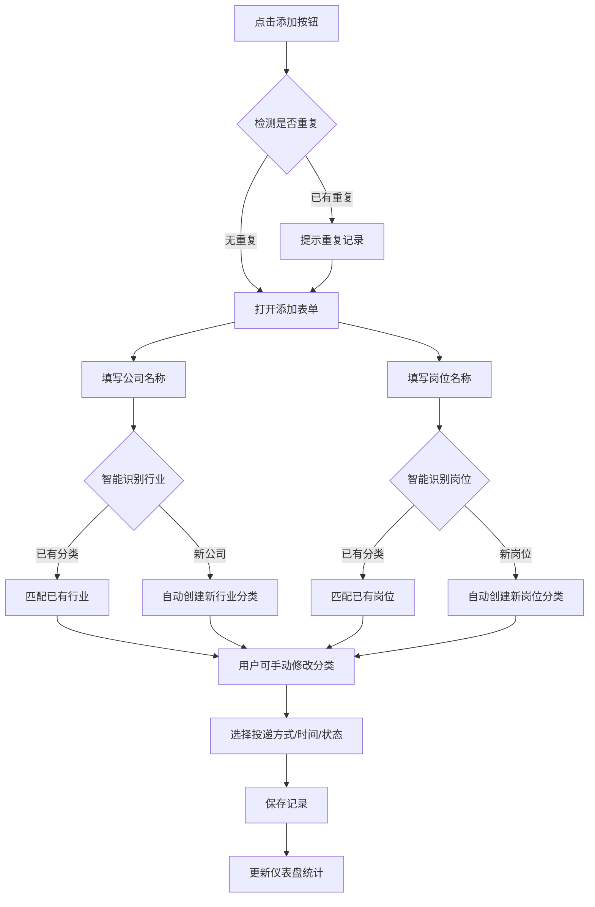
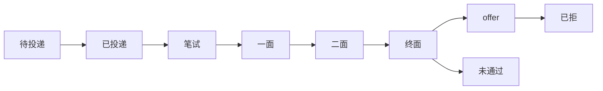

# 投递追踪工具 - 产品需求文档

## 1. 产品概述

一款帮助用户管理求职投递记录的工具，支持多设备访问（响应式设计）、本地数据存储、**智能自动分类**、数据导入导出和面试提醒功能。

### 核心价值
- 随时随地记录投递状态，告别 Excel 表格的繁琐
- **智能自动分类**，输入公司名和岗位名即可自动识别行业和岗位类型
- 手动修改分类也很方便，支持随时调整
- 面试时间提醒，不再错过任何面试机会
- 数据导出备份，换设备也能无缝衔接

---

## 2. 功能模块

### 2.1 页面结构

| 页面 | 功能描述 |
|------|----------|
| **首页（仪表盘）** | 投递统计概览、快速添加入口、全局搜索 |
| **投递列表** | 展示所有投递记录、支持筛选/排序 |
| **投递详情** | 查看/编辑单条投递信息、面试记录 |
| **分类管理** | 管理行业分类和岗位分类 |
| **数据管理** | 数据导入（Excel）/ 导出（Excel/CSV） |

### 2.2 功能详情

#### 2.2.1 投递记录管理

**投递信息字段：**

| 字段 | 类型 | 必填 | 说明 |
|------|------|------|------|
| 公司名称 | 文本 | 是 | - |
| 岗位名称 | 文本 | 是 | - |
| 投递方式 | 下拉选择 | 是 | 官网/邮箱/BOSS直聘/实习僧 |
| 投递时间 | 日期 | 是 | - |
| 当前状态 | 下拉选择 | 是 | 8种状态可选 |
| 行业分类 | 树形选择 | 是 | 用户自定义 |
| 岗位分类 | 树形选择 | 是 | 用户自定义 |
| 标签 | 标签组 | 否 | 可自定义添加 |
| 备注 | 多行文本 | 否 | - |

**投递状态（8种）：**
1. 待投递
2. 已投递
3. 笔试
4. 一面
5. 二面
6. 终面
7. offer
8. 未通过
9. 已拒

**面试记录字段：**

| 字段 | 类型 | 说明 |
|------|------|------|
| 面试轮次 | 文本 | 如"一面"、"二面"等 |
| 面试时间 | 日期时间 | - |
| 面试形式 | 下拉选择 | 视频面试/电话面试/现场面试 |
| 面试反馈 | 多行文本 | - |

#### 2.2.2 智能自动分类（核心功能）

**自动识别规则：**

| 输入 | 识别类型 | 示例 |
|------|----------|------|
| 公司名称 | 行业分类 | 输入"腾讯"→识别为"互联网/游戏" |
| 岗位名称 | 岗位分类 | 输入"前端开发"→识别为"前端" |

**分类识别逻辑：**
1. **公司名 → 行业识别**：基于内置公司库匹配行业（如"阿里/腾讯/字节"→互联网）
2. **岗位名 → 岗位识别**：基于关键词匹配（如"Java/Python/Go"→后端开发）
3. **智能扩展**：识别到新公司/岗位时，自动创建新分类
4. **手动修正**：用户可随时修改自动识别的分类

**行业关键词库（示例）：**
- 互联网/游戏：腾讯、阿里、字节、百度、美团、字节跳动、网易、京东、拼多多...
- 金融：银行、证券、基金、保险、投资、信托...
- 制造业：比亚迪、富士康、工业制造...
- 教育：新东方、好未来、作业帮、教育科技...
- 医疗健康：医药、医院、医疗、 biotech...

**岗位关键词库（示例）：**
- 前端：前端、前端开发、Web开发、React、Vue...
- 后端：后端、后端开发、Java、Python、Go、服务端...
- 算法：算法、机器学习、深度学习、AI、人工智能...
- 产品：产品经理、产品助理、PM...
- 设计：UI、UX、视觉设计、交互设计...
- 测试：测试、QA、功能测试...
- 运维：运维、SRE、DevOps...
- 数据：数据分析师、数据工程师、大数据...

**交互流程：**
1. 用户输入公司名称 → 系统自动识别行业 → 显示在分类输入框
2. 用户输入岗位名称 → 系统自动识别岗位类型 → 显示在分类输入框
3. 如有新公司/新岗位 → 自动创建新分类 → 用户可修改
4. 分类可设置颜色便于识别
5. 支持在分类管理页面统一管理所有分类

#### 2.2.3 分类管理

- 支持添加、编辑、删除行业分类
- 支持添加、编辑、删除岗位分类
- 分类可设置颜色便于识别
- 删除分类时需确认，避免误删
- 分类被删除时，投递记录中的该分类会置空，需手动重新分类

#### 2.2.4 搜索与筛选

**全局搜索：**
- 支持按公司名称、岗位名称搜索
- 实时搜索，输入即显示结果

**筛选条件：**
- 按行业分类筛选
- 按岗位分类筛选
- 按投递状态筛选
- 按投递时间范围筛选

**排序：**
- 按投递时间倒序（默认）
- 按公司名称字母排序
- 按更新时间排序

#### 2.2.5 数据导入导出

**导出功能：**
- 导出为 Excel 格式
- 导出为 CSV 格式
- 可选择导出全部或筛选后的数据

**导入功能：**
- 支持导入 Excel 文件
- 自动识别表头字段
- 导入前预览并确认

#### 2.2.6 面试提醒

- 设置面试时间后，自动在面试前提醒
- 使用浏览器通知或页面内弹窗提醒
- 提醒时间可配置（面试前1小时/1天）

#### 2.2.6 其他功能

- **重复检测**：添加投递时检测是否有相同公司+岗位的记录，提示用户
- **状态快捷更新**：列表页支持一键点击切换状态

---

## 3. 核心流程

### 3.1 添加投递记录

### 3.2 状态流转

---

## 4. 技术方案

### 4.1 技术栈

| 技术 | 选择 | 说明 |
|------|------|------|
| 前端框架 | React + TypeScript | 稳定成熟 |
| 构建工具 | Vite | 快速开发 |
| UI 组件库 | Ant Design | 企业级体验 |
| 本地存储 | IndexedDB | 支持大容量结构化数据 |
| 数据层 | Dexie.js | IndexedDB 封装 |
| 样式方案 | Tailwind CSS | 响应式快速开发 |
| 图表 | ECharts | 数据可视化 |
| Excel 处理 | xlsx 库 | 导入导出 |
| 日期处理 | Day.js | 轻量日期库 |
| 提醒功能 | Browser Notification API | 原生通知 |

### 4.2 数据存储

- 所有数据存储在浏览器本地 IndexedDB
- 无需注册，打开即用
- 支持数据导入导出作为备份方案

---

## 5. 界面设计

### 5.1 设计风格

**主题色：**
- 主色调：浅米色背景 (#FDF8F3)
- 强调色：温暖橙色 (#E07A5F)
- 文字色：深棕色 (#3D405B)

**字体：**
- 标题：思源宋体 / Noto Serif SC
- 正文：思源黑体 / Noto Sans SC

**布局：**
- 顶部导航 + 侧边栏（桌面端）
- 底部导航（移动端）
- 卡片式内容展示

**交互：**
- 流畅的状态切换动画
- 列表项悬停高亮
- 按钮点击反馈
- 表单验证即时提示

### 5.2 响应式断点

| 设备 | 宽度 | 布局 |
|------|------|------|
| 桌面 | ≥1024px | 三栏/两栏布局 |
| 平板 | 768px-1023px | 两栏布局 |
| 手机 | <768px | 单栏布局 |

---

## 6. 非功能需求

### 6.1 性能
- 首屏加载时间 < 2秒
- 列表操作响应 < 100ms
- 支持至少 1000 条投递记录

### 6.2 兼容性
- 支持 Chrome、Firefox、Safari、Edge 最新版本
- 移动端支持 iOS Safari、Android Chrome

### 6.3 数据安全
- 数据仅存储在本地，不上传服务器
- 支持密码保护（可选功能预留）
