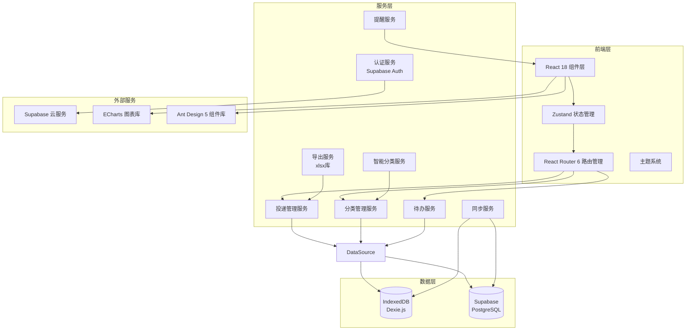
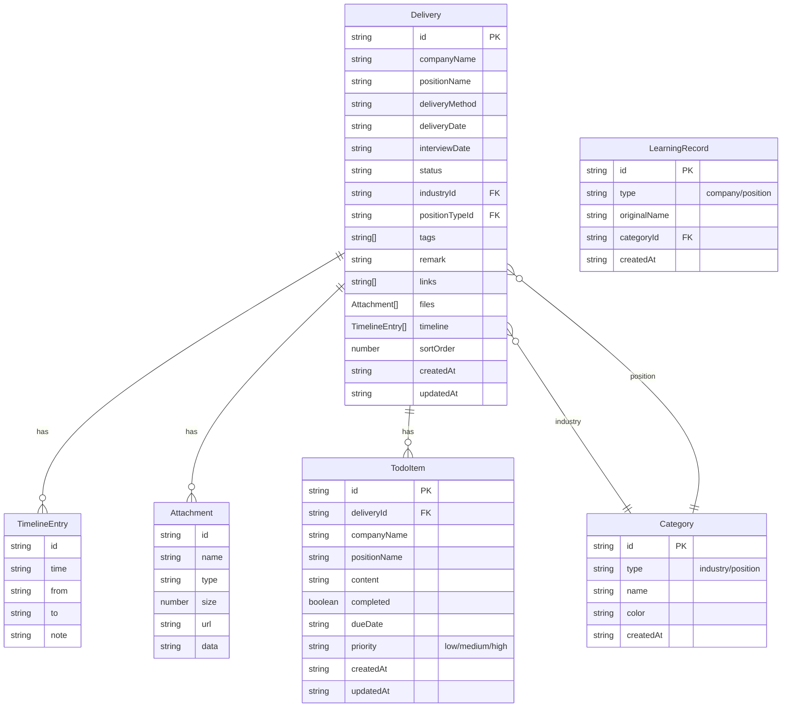
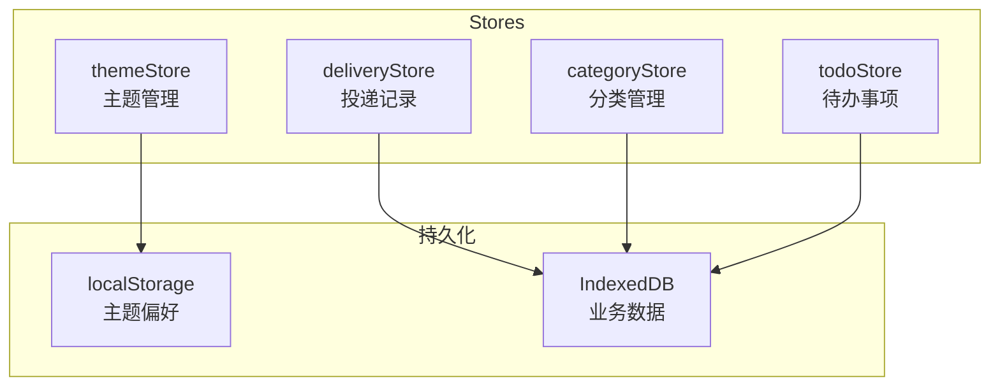
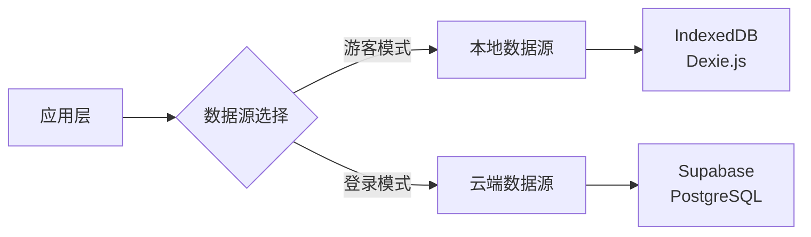
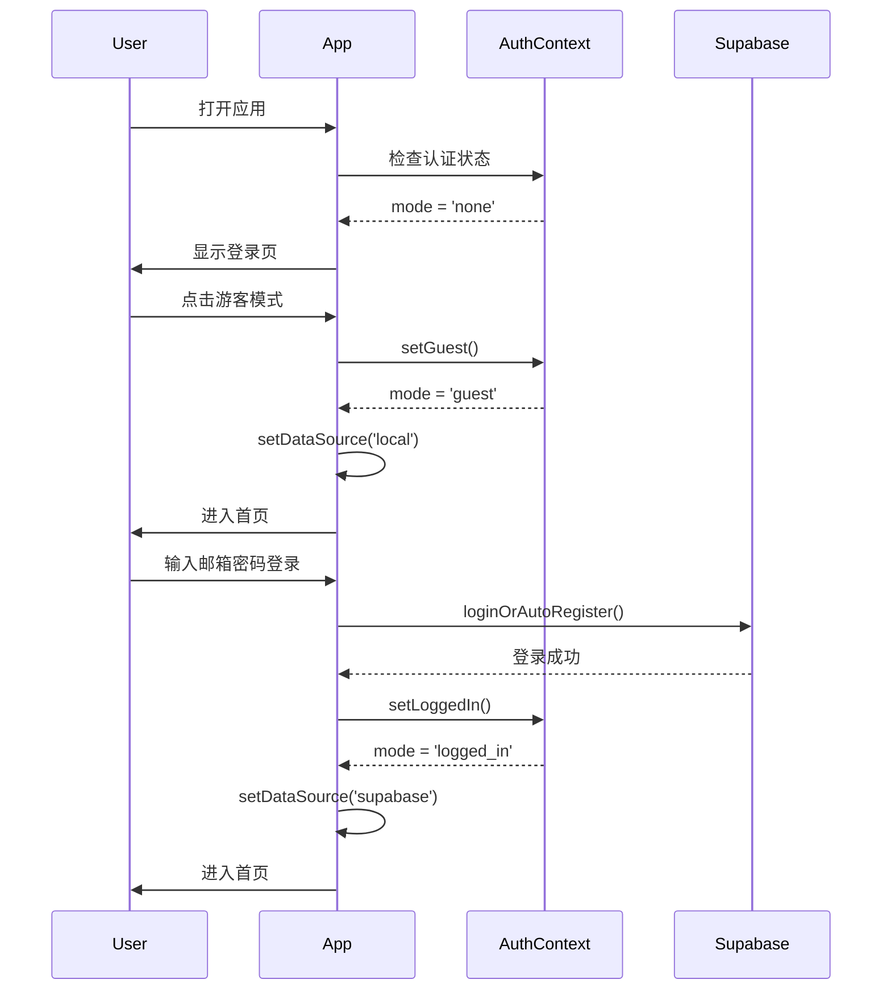

# JobTracker 求职进度管理 - 技术架构文档

## 1. 架构设计



---

## 2. 技术选型

### 2.1 核心技术栈

| 技术 | 版本 | 用途 |
|------|------|------|
| React | ^18.2.0 | 前端框架 |
| TypeScript | ^5.3.2 | 类型安全 |
| Vite | ^5.0.8 | 构建工具 |
| Ant Design | ^5.15.0 | UI 组件库 |
| Tailwind CSS | ^3.4.0 | 原子化样式 |
| Zustand | ^4.4.7 | 状态管理 |
| React Router | ^6.20.0 | 路由管理 |
| Dexie.js | ^4.0.1 | IndexedDB 封装 |
| Supabase Client | ^2.105.4 | 云端数据库 |
| ECharts | ^5.4.3 | 数据可视化 |
| xlsx | ^0.18.5 | Excel 导入导出 |
| dayjs | ^1.11.10 | 日期处理 |
| uuid | ^9.0.0 | UUID 生成 |

### 2.2 额外依赖

| 技术 | 版本 | 用途 |
|------|------|------|
| @ant-design/icons | ^5.2.6 | Ant Design 图标 |
| lucide-react | ^0.294.0 | Lucide 图标库 |
| clsx | ^2.0.0 | 类名条件组合 |
| docx | ^8.5.0 | Word 文档生成 |
| mammoth | ^1.6.0 | Word 文档解析 |
| tesseract.js | ^5.0.0 | OCR 文字识别 |
| recharts | ^2.10.0 | React 图表库 |

---

## 3. 路由定义

| 路由 | 页面组件 | 说明 | 权限 |
|------|----------|------|------|
| `/login` | LoginPage | 登录/游客模式入口 | 公开 |
| `/reset-password` | ResetPassword | 密码重置 | 公开 |
| `/dashboard` | Dashboard | 首页仪表盘 | 需认证 |
| `/deliveries` | DeliveryList | 投递列表 | 需认证 |
| `/deliveries/:id` | DeliveryDetail | 投递详情 | 需认证 |
| `/categories` | CategoryManager | 分类管理 | 需认证 |
| `/todos` | TodoList | 待办事项 | 需认证 |
| `/analytics` | Analytics | 数据分析 | 需认证 |
| `/data` | DataManager | 数据管理 | 需认证 |
| `/recycle-bin` | RecycleBin | 回收站 | 需认证 |
| `/` | - | 重定向到 `/dashboard` | 需认证 |

### 3.1 路由守卫逻辑

```typescript
// 权限控制流程
1. 访问任意路由
2. 检查 AuthContext 中的 mode
   - 'none' → 跳转 /login
   - 'guest' → 使用本地数据源
   - 'logged_in' → 使用云端数据源
3. 初始化数据（fetchCategories, fetchDeliveries）
4. 渲染页面内容
```

---

## 4. 数据模型

### 4.1 ER 图



### 4.2 TypeScript 类型定义

```typescript
// 投递状态（13种）
type DeliveryStatus =
  | '待投递'
  | '仅沟通'
  | '已投递'
  | '通过初筛'
  | '笔试'
  | '一面'
  | '二面'
  | '三面'
  | '已Offer'
  | '未通过'
  | '已接受'
  | '已拒绝'
  | '已放弃';

// 面试形式
type InterviewType = '视频面试' | '电话面试' | '现场面试';

// 分类类型
type CategoryType = 'industry' | 'position';

// 投递记录
interface Delivery {
  id: string;
  companyName: string;
  positionName: string;
  deliveryMethod: string;
  deliveryDate: string;
  interviewDate?: string;
  status: DeliveryStatus;
  industryId: string;
  positionTypeId: string;
  tags: string[];
  remark?: string;
  links: string[];
  files: Attachment[];
  timeline: TimelineEntry[];
  sortOrder: number;
  createdAt: string;
  updatedAt: string;
}

// 时间线条目
interface TimelineEntry {
  id: string;
  time: string;
  from: DeliveryStatus | null;
  to: DeliveryStatus;
  note?: string;
}

// 附件
interface Attachment {
  id: string;
  name: string;
  type: string;
  size: number;
  url: string;
  data?: string;
}

// 分类
interface Category {
  id: string;
  type: CategoryType;
  name: string;
  color: string;
  createdAt: string;
}

// 待办事项
interface TodoItem {
  id: string;
  deliveryId: string;
  companyName: string;
  positionName: string;
  content: string;
  completed: boolean;
  dueDate?: string;
  priority: 'low' | 'medium' | 'high';
  createdAt: string;
  updatedAt: string;
}

// 学习记录（用于智能推荐）
interface LearningRecord {
  id: string;
  type: 'company' | 'position';
  originalName: string;
  categoryId: string;
  createdAt: string;
}
```

### 4.3 IndexedDB 表结构

```typescript
import Dexie from 'dexie';

class JobTrackerDB extends Dexie {
  deliveries!: Dexie.Table<Delivery, string>;
  categories!: Dexie.Table<Category, string>;
  todos!: Dexie.Table<TodoItem, string>;
  learnings!: Dexie.Table<LearningRecord, string>;

  constructor() {
    super('JobTrackerDB');
    this.version(1).stores({
      deliveries: 'id, companyName, positionName, status, deliveryDate, industryId, positionTypeId, createdAt',
      categories: 'id, type, name',
      todos: 'id, deliveryId, completed, dueDate, createdAt',
      learnings: 'id, type, originalName, categoryId'
    });
  }
}

export const db = new JobTrackerDB();
```

---

## 5. 状态管理

### 5.1 Zustand Store 架构



### 5.2 主题 Store

```typescript
interface ThemeState {
  currentTheme: ThemeName;      // 'beige' | 'coffee'
  themeConfig: ThemeConfig;     // 完整主题配置
  setTheme: (theme: ThemeName) => void;
}

// 持久化：localStorage
const STORAGE_KEY = 'jobtracker-theme';
```

### 5.3 投递 Store

```typescript
interface DeliveryState {
  deliveries: Delivery[];
  stats: DeliveryStats;
  fetchDeliveries: () => Promise<void>;
  createDelivery: (data: CreateDeliveryDTO) => Promise<void>;
  updateDelivery: (id: string, data: UpdateDeliveryDTO) => Promise<void>;
  deleteDelivery: (id: string) => Promise<void>;
  quickApply: (id: string) => Promise<void>;
  checkDuplicate: (company: string, position: string) => Promise<Delivery | undefined>;
  reorderDeliveries: (from: number, to: number) => Promise<void>;
  fetchStats: () => Promise<void>;
}
```

### 5.4 分类 Store

```typescript
interface CategoryState {
  industries: Category[];
  positions: Category[];
  fetchCategories: () => Promise<void>;
  createCategory: (data: CreateCategoryDTO) => Promise<void>;
  updateCategory: (id: string, data: UpdateCategoryDTO) => Promise<void>;
  deleteCategory: (id: string) => Promise<void>;
}
```

### 5.5 待办 Store

```typescript
interface TodoState {
  todos: TodoItem[];
  fetchTodos: () => Promise<void>;
  createTodo: (data: CreateTodoDTO) => Promise<void>;
  updateTodo: (id: string, data: UpdateTodoDTO) => Promise<void>;
  deleteTodo: (id: string) => Promise<void>;
  toggleComplete: (id: string) => Promise<void>;
}
```

---

## 6. 数据源架构

### 6.1 双数据源设计



### 6.2 数据源切换逻辑

```typescript
// services/dataSource.ts
type DataSourceType = 'local' | 'supabase';

let currentDataSource: DataSourceType = 'local';

export const setDataSource = (source: DataSourceType) => {
  currentDataSource = source;
};

export const getDataSource = () => currentDataSource;

// 所有 Service 层根据当前数据源路由到不同的实现
```

### 6.3 Service 层接口统一

```typescript
// 投递服务接口
interface IDeliveryService {
  getAll(): Promise<Delivery[]>;
  getById(id: string): Promise<Delivery | undefined>;
  create(data: CreateDeliveryDTO): Promise<Delivery>;
  update(id: string, data: UpdateDeliveryDTO): Promise<Delivery>;
  delete(id: string): Promise<void>;
}

// 本地实现
class LocalDeliveryService implements IDeliveryService {
  // 使用 Dexie.js 操作 IndexedDB
}

// 云端实现
class SupabaseDeliveryService implements IDeliveryService {
  // 使用 Supabase Client 操作 PostgreSQL
}
```

---

## 7. 核心服务

### 7.1 智能分类服务

```typescript
interface ClassificationService {
  // 根据公司名称识别行业
  recognizeIndustry(companyName: string): Promise<Category | null>;

  // 根据岗位名称识别岗位类型
  recognizePosition(positionName: string): Promise<Category | null>;

  // 记录学习结果（用于后续推荐）
  learn(type: 'company' | 'position', originalName: string, categoryId: string): Promise<void>;

  // 获取学习记录
  getLearningRecords(type: 'company' | 'position'): Promise<LearningRecord[]>;
}
```

### 7.2 导出服务

```typescript
interface ExportData {
  deliveries: Delivery[];
  categories: Category[];
  exportDate: string;
  version: string;
}

interface ExportService {
  exportToExcel(data: ExportData): Promise<void>;
  exportToCSV(data: ExportData): Promise<void>;
}
```

### 7.3 同步服务

```typescript
interface SyncService {
  // 将本地数据同步到云端
  syncLocalDataToCloud(): Promise<{
    categories: number;
    deliveries: number;
    learnings: number;
  }>;

  // 同步队列管理（处理离线变更）
  addToQueue(operation: SyncOperation): void;
  processQueue(): Promise<void>;
}
```

### 7.4 提醒服务

```typescript
interface ReminderService {
  // 检查即将到来的面试
  checkUpcomingInterviews(): Promise<void>;

  // 显示提醒弹窗
  showReminder(delivery: Delivery): void;

  // 播放提示音
  playNotificationSound(): void;
}

// 定时检查（每5分钟）
setInterval(() => {
  reminderService.checkUpcomingInterviews();
}, 5 * 60 * 1000);
```

---

## 8. 组件架构

### 8.1 组件目录结构

```
src/job-tracker/
├── components/
│   ├── layout/
│   │   └── AppLayout.tsx          # 整体布局（侧边栏 + 内容区）
│   ├── common/
│   │   ├── StatusTag.tsx          # 状态标签组件
│   │   ├── CategoryTag.tsx        # 分类标签组件
│   │   ├── AchievementBadge.tsx   # 成就徽章组件
│   │   └── InterviewReminder.tsx  # 面试提醒弹窗
│   ├── delivery/
│   │   ├── DeliveryCard.tsx       # 投递卡片
│   │   ├── DeliveryForm.tsx       # 投递表单
│   │   └── QuickAddButton.tsx     # 快速添加按钮
│   └── charts/
│       ├── DeliveryTrendChart.tsx       # 投递趋势图
│       ├── IndustryDistributionChart.tsx # 行业分布图
│       ├── InterviewProgressChart.tsx    # 面试进度图
│       └── PositionDistributionChart.tsx # 岗位分布图
├── pages/
│   ├── LoginPage.tsx              # 登录页
│   ├── ResetPassword.tsx          # 重置密码
│   ├── Dashboard.tsx              # 首页仪表盘
│   ├── DeliveryList.tsx           # 投递列表
│   ├── DeliveryDetail.tsx         # 投递详情
│   ├── CategoryManager.tsx        # 分类管理
│   ├── TodoList.tsx               # 待办事项
│   ├── Analytics.tsx              # 数据分析
│   ├── DataManager.tsx            # 数据管理
│   └── RecycleBin.tsx             # 回收站
├── services/
│   ├── db.ts                      # 数据库初始化
│   ├── dataSource.ts              # 数据源管理
│   ├── deliveryService.ts         # 投递服务（本地）
│   ├── supabaseDeliveryService.ts # 投递服务（云端）
│   ├── categoryService.ts         # 分类服务
│   ├── todoService.ts             # 待办服务
│   ├── exportService.ts           # 导出服务
│   ├── syncService.ts             # 同步服务
│   ├── reminderService.ts         # 提醒服务
│   ├── classificationService.ts   # 智能分类服务
│   ├── learningService.ts         # 学习记录服务
│   ├── interviewService.ts        # 面试服务
│   ├── audioService.ts            # 音频服务
│   ├── supabaseClient.ts          # Supabase 客户端
│   └── syncQueue.ts               # 同步队列
├── stores/
│   ├── themeStore.ts              # 主题状态
│   ├── deliveryStore.ts           # 投递状态
│   ├── categoryStore.ts           # 分类状态
│   └── todoStore.ts               # 待办状态
├── contexts/
│   └── AuthContext.tsx            # 认证上下文
├── hooks/
│   └── useAuth.ts                 # 认证 Hook
└── types/
    └── index.ts                   # 类型定义
```

### 8.2 布局组件

```mermaid
graph TD
    App[App.tsx] --> AuthProvider[AuthProvider]
    AuthProvider --> ConfigProvider[ConfigProvider<br/>Ant Design]
    ConfigProvider --> BrowserRouter[BrowserRouter]
    BrowserRouter --> Routes[Routes]
    Routes --> LoginPage[/login]
    Routes --> ProtectedRoute[ProtectedRoute]
    ProtectedRoute --> AppLayout[AppLayout]
    AppLayout --> Sider[Sidebar<br/>导航菜单]
    AppLayout --> Content[Content<br/>页面内容]
    Content --> Dashboard[/dashboard]
    Content --> DeliveryList[/deliveries]
    Content --> DeliveryDetail[/deliveries/:id]
    Content --> CategoryManager[/categories]
    Content --> TodoList[/todos]
    Content --> Analytics[/analytics]
    Content --> DataManager[/data]
    Content --> RecycleBin[/recycle-bin]
```

---

## 9. 主题系统

### 9.1 主题配置

```typescript
interface ThemeConfig {
  name: ThemeName;
  label: string;
  primary: string;        // 主色
  bgContainer: string;    // 容器背景
  bgPage: string;         // 页面背景
  border: string;         // 边框色
  text: string;           // 文字主色
  textSecondary: string;  // 文字次要色
  cardBg: string;         // 卡片背景
  sidebarBg: string;      // 侧边栏背景
  sidebarBorder: string;  // 侧边栏边框
  headerText: string;     // 标题文字色
  accent: string;         // 强调色
  fontFamily: string;     // 字体
}
```

### 9.2 主题列表

| 主题 | 主色 | 页面背景 | 风格 |
|------|------|----------|------|
| beige | `#E07A5F` | `#FAF7F4` | 温暖淡雅 |
| coffee | `#A67B5B` | `#F5EDE5` | 经典沉稳 |

### 9.3 主题应用

```typescript
// 通过 Ant Design ConfigProvider 注入主题
<ConfigProvider
  theme={{
    token: {
      colorPrimary: themeConfig.primary,
      colorBgContainer: themeConfig.bgContainer,
      colorBorder: themeConfig.border,
      colorText: themeConfig.text,
      borderRadius: 8,
      fontFamily: themeConfig.fontFamily
    },
    components: {
      Menu: {
        itemSelectedBg: themeConfig.primary + '15',
        itemSelectedColor: themeConfig.primary,
      },
      Card: {
        colorBgContainer: themeConfig.cardBg,
      }
    }
  }}
>
```

---

## 10. 认证与授权

### 10.1 认证上下文

```typescript
interface AuthContextType {
  mode: AuthMode;           // 'none' | 'guest' | 'logged_in'
  user: User | null;
  setGuest: () => void;
  setLoggedIn: () => void;
  setNone: () => void;
}

type AuthMode = 'none' | 'guest' | 'logged_in';
```

### 10.2 认证流程



---

## 11. 性能优化

### 11.1 数据加载策略

- **懒加载**：页面级别组件按需加载
- **数据缓存**：Zustand Store 缓存数据，减少重复请求
- **分页加载**：列表数据前端分页，避免一次性加载过多

### 11.2 渲染优化

- **useMemo**：复杂计算（统计数据、筛选结果）缓存
- **useCallback**：事件处理函数缓存
- **React.memo**：纯组件避免不必要的重渲染

### 11.3 资源优化

- **Vite 构建**：Tree Shaking、代码分割
- **图片优化**：附件使用 Base64 内联，控制大小
- **字体优化**：Google Fonts 按需加载

---

## 12. 安全考虑

### 12.1 数据安全

- 游客模式数据仅存储在本地 IndexedDB
- 登录用户数据同步到 Supabase 云端（PostgreSQL Row Level Security）
- 敏感操作（删除、清空数据）需要二次确认

### 12.2 认证安全

- 密码最小长度 6 位
- 忘记密码使用邮箱验证码（6位数字，60秒倒计时）
- Supabase Auth 处理密码加密和会话管理

### 12.3 输入验证

- 表单字段必填校验
- 邮箱格式校验
- 文件大小限制（10MB）
- XSS 防护（React 自动转义）

---

## 13. 部署与构建

### 13.1 构建配置

```json
{
  "scripts": {
    "dev": "vite",
    "build": "tsc && vite build",
    "lint": "eslint . --ext ts,tsx --report-unused-disable-directives --max-warnings 0",
    "preview": "vite preview"
  }
}
```

### 13.2 环境变量

```
VITE_SUPABASE_URL=your_supabase_url
VITE_SUPABASE_ANON_KEY=your_supabase_anon_key
```

### 13.3 输出目录

- 构建输出：`dist/`
- 静态资源：`dist/assets/`
- 入口文件：`dist/index.html`
