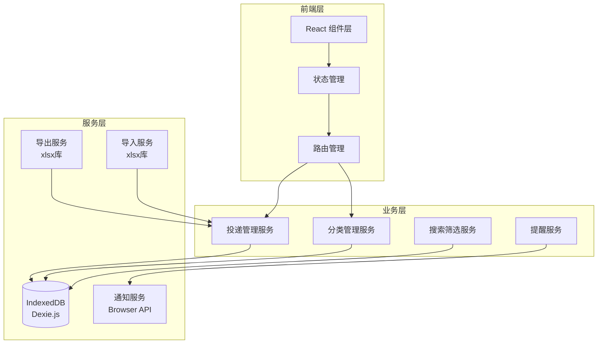
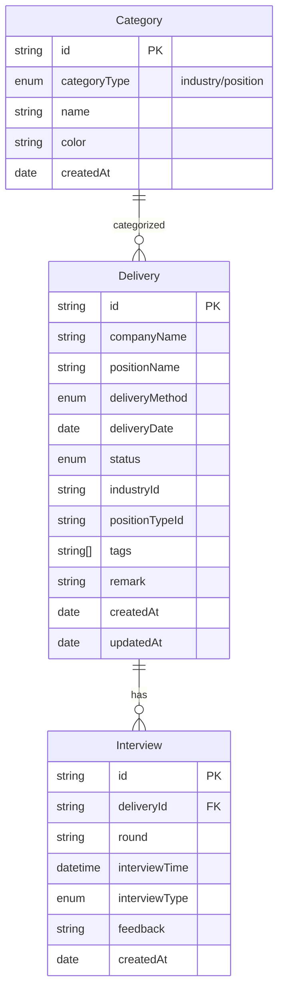

# 投递追踪工具 - 技术架构文档

## 1. 架构设计



---

## 2. 技术选型

| 技术 | 版本 | 用途 |
|------|------|------|
| React | ^18.2.0 | 前端框架 |
| TypeScript | ^5.0.0 | 类型安全 |
| Vite | ^5.0.0 | 构建工具 |
| Ant Design | ^5.x | UI 组件库 |
| Tailwind CSS | ^3.4.0 | 样式方案 |
| Dexie.js | ^4.0.0 | IndexedDB 封装 |
| xlsx | ^0.18.5 | Excel 导入导出 |
| dayjs | ^1.11.0 | 日期处理 |
| ECharts | ^5.4.0 | 数据可视化 |
| React Router | ^6.x | 路由管理 |
| Zustand | ^4.x | 状态管理 |

---

## 3. 路由定义

| 路由 | 页面 | 说明 |
|------|------|------|
| `/` | 首页/仪表盘 | 统计数据、快速操作入口 |
| `/deliveries` | 投递列表 | 所有投递记录 |
| `/deliveries/:id` | 投递详情 | 单条记录详情 |
| `/categories` | 分类管理 | 行业/岗位分类管理 |
| `/data` | 数据管理 | 导入导出 |

---

## 4. 数据模型

### 4.1 数据模型定义



### 4.2 TypeScript 类型定义

```typescript
// 投递方式
type DeliveryMethod = '官网' | '邮箱' | 'BOSS直聘' | '实习僧';

// 投递状态
type DeliveryStatus = 
  | '待投递' 
  | '已投递' 
  | '笔试' 
  | '一面' 
  | '二面' 
  | '终面' 
  | 'offer' 
  | '未通过' 
  | '已拒';

// 面试形式
type InterviewType = '视频面试' | '电话面试' | '现场面试';

// 分类类型
type CategoryType = 'industry' | 'position';

// 投递记录
interface Delivery {
  id: string;
  companyName: string;
  positionName: string;
  deliveryMethod: DeliveryMethod;
  deliveryDate: string;
  status: DeliveryStatus;
  industryId: string;
  positionTypeId: string;
  tags: string[];
  remark?: string;
  createdAt: string;
  updatedAt: string;
}

// 面试记录
interface Interview {
  id: string;
  deliveryId: string;
  round: string;
  interviewTime: string;
  interviewType: InterviewType;
  feedback?: string;
  createdAt: string;
}

// 分类
interface Category {
  id: string;
  type: CategoryType;
  name: string;
  color: string;
  createdAt: string;
}
```

### 4.3 IndexedDB 表结构

```typescript
// 数据库定义
const db = new Dexie('JobTrackerDB');

db.version(1).stores({
  deliveries: '++id, companyName, positionName, status, deliveryDate, industryId, positionTypeId, createdAt',
  interviews: '++id, deliveryId, interviewTime',
  categories: '++id, type, name'
});
```

---

## 5. 核心服务

### 5.1 投递管理服务

```typescript
interface DeliveryService {
  // 增删改查
  createDelivery(data: CreateDeliveryDTO): Promise<Delivery>;
  updateDelivery(id: string, data: UpdateDeliveryDTO): Promise<Delivery>;
  deleteDelivery(id: string): Promise<void>;
  getDeliveryById(id: string): Promise<Delivery | undefined>;
  
  // 列表查询
  getAllDeliveries(): Promise<Delivery[]>;
  getDeliveriesByFilter(filter: DeliveryFilter): Promise<Delivery[]>;
  
  // 搜索
  searchDeliveries(keyword: string): Promise<Delivery[]>;
  
  // 重复检测
  checkDuplicate(companyName: string, positionName: string): Promise<Delivery | undefined>;
}
```

### 5.2 分类管理服务

```typescript
interface CategoryService {
  // 行业分类
  getIndustries(): Promise<Category[]>;
  createIndustry(data: CreateCategoryDTO): Promise<Category>;
  updateIndustry(id: string, data: UpdateCategoryDTO): Promise<Category>;
  deleteIndustry(id: string): Promise<void>;
  
  // 岗位分类
  getPositions(): Promise<Category[]>;
  createPosition(data: CreateCategoryDTO): Promise<Category>;
  updatePosition(id: string, data: UpdateCategoryDTO): Promise<Category>;
  deletePosition(id: string): Promise<void>;
}
```

### 5.3 智能分类服务

```typescript
interface ClassificationService {
  // 识别行业
  recognizeIndustry(companyName: string): Promise<Category | null>;
  
  // 识别岗位类型
  recognizePosition(positionName: string): Promise<Category | null>;
  
  // 自动创建分类
  autoCreateCategory(name: string, type: CategoryType): Promise<Category>;
  
  // 获取或创建分类
  getOrCreateCategory(name: string, type: CategoryType): Promise<Category>;
}
```

### 5.4 提醒服务

```typescript
interface ReminderService {
  // 设置提醒
  scheduleReminder(interview: Interview): void;
  
  // 取消提醒
  cancelReminder(interviewId: string): void;
  
  // 发送通知
  sendNotification(title: string, body: string): Promise<void>;
}
```

---

## 6. 组件结构

```
src/
├── components/
│   ├── layout/
│   │   ├── AppLayout.tsx        # 整体布局
│   │   ├── DesktopNav.tsx      # 桌面端导航
│   │   └── MobileNav.tsx       # 移动端导航
│   ├── common/
│   │   ├── SearchBar.tsx       # 全局搜索
│   │   ├── StatusTag.tsx       # 状态标签
│   │   └── CategoryTag.tsx     # 分类标签
│   ├── delivery/
│   │   ├── DeliveryCard.tsx    # 投递卡片
│   │   ├── DeliveryForm.tsx    # 投递表单
│   │   ├── DeliveryList.tsx    # 投递列表
│   │   └── StatusSelector.tsx  # 状态选择器
│   ├── interview/
│   │   ├── InterviewCard.tsx   # 面试记录卡片
│   │   └── InterviewForm.tsx   # 面试表单
│   ├── category/
│   │   ├── CategoryManager.tsx # 分类管理
│   │   └── CategoryForm.tsx    # 分类表单
│   └── data/
│       ├── ExportPanel.tsx     # 导出面板
│       └── ImportPanel.tsx     # 导入面板
├── pages/
│   ├── Dashboard.tsx           # 首页/仪表盘
│   ├── DeliveryList.tsx        # 投递列表页
│   ├── DeliveryDetail.tsx      # 投递详情页
│   ├── CategoryManager.tsx     # 分类管理页
│   └── DataManager.tsx         # 数据管理页
├── services/
│   ├── db.ts                   # 数据库初始化
│   ├── deliveryService.ts      # 投递服务
│   ├── categoryService.ts      # 分类服务
│   ├── classificationService.ts # 智能分类服务（核心）
│   ├── interviewService.ts     # 面试服务
│   ├── exportService.ts        # 导出服务
│   ├── importService.ts        # 导入服务
│   └── reminderService.ts      # 提醒服务
├── stores/
│   ├── deliveryStore.ts        # 投递状态管理
│   └── categoryStore.ts        # 分类状态管理
├── hooks/
│   ├── useDeliveries.ts        # 投递数据 Hook
│   ├── useCategories.ts        # 分类数据 Hook
│   └── useNotifications.ts     # 通知 Hook
├── types/
│   └── index.ts                # 类型定义
└── utils/
    ├── constants.ts           # 常量定义
    └── helpers.ts              # 辅助函数
```

---

## 7. 目录结构

```
job-tracker/
├── public/
│   └── favicon.ico
├── src/
│   ├── components/           # 组件
│   ├── pages/                # 页面
│   ├── services/             # 服务层
│   ├── stores/               # 状态管理
│   ├── hooks/                # 自定义 Hooks
│   ├── types/                # TypeScript 类型
│   ├── utils/                # 工具函数
│   ├── App.tsx               # 根组件
│   ├── main.tsx              # 入口文件
│   └── index.css             # 全局样式
├── index.html
├── package.json
├── tsconfig.json
├── vite.config.ts
├── tailwind.config.js
└── postcss.config.js
```

---

## 8. 依赖说明

### 核心依赖

```json
{
  "dependencies": {
    "react": "^18.2.0",
    "react-dom": "^18.2.0",
    "react-router-dom": "^6.22.0",
    "antd": "^5.15.0",
    "@ant-design/icons": "^5.2.6",
    "dexie": "^4.0.1",
    "xlsx": "^0.18.5",
    "dayjs": "^1.11.10",
    "echarts": "^5.4.3",
    "echarts-for-react": "^3.0.2",
    "zustand": "^4.5.0",
    "uuid": "^9.0.0"
  },
  "devDependencies": {
    "@types/react": "^18.2.0",
    "@types/react-dom": "^18.2.0",
    "@types/uuid": "^9.0.0",
    "@vitejs/plugin-react": "^4.2.0",
    "typescript": "^5.3.0",
    "vite": "^5.1.0",
    "tailwindcss": "^3.4.0",
    "postcss": "^8.4.0",
    "autoprefixer": "^10.4.0"
  }
}
```
